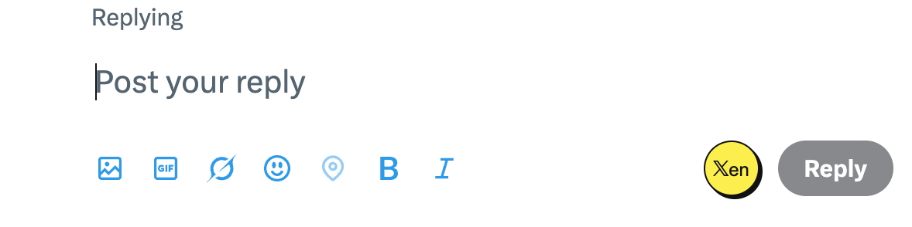

# Xen

Xen is a browser extension that helps you craft AI-powered replies on X/Twitter.

## ✨ Features

*   **AI-Powered Replies:** Generate clever and relevant replies to tweets using advanced AI models.
*   **Seamless Integration:** A "Xen" button appears next to the standard reply button on X/Twitter for quick access.
*   **Customizable AI Persona:** The AI is prompted to act as a "witty and insightful commentator," ensuring unique and engaging responses.
*   **API Key Management:** Easily configure your OpenRouter API key through a simple popup interface.

## 🚀 Installation & Setup

Xen is a Plasmo extension. To use it, load it as an unpacked extension in your browser.

1.  **Clone the repository:**
    ```bash
    git clone https://github.com/bineta-io/xen.git
    cd xen
    ```
2.  **Install dependencies:**
    ```bash
    npm install
    ```
3.  **Build the extension:**
    ```bash
    npm run build
    ```
    This creates a `build/chrome-mv3-prod` directory.
4.  **Load in your browser (Chrome/Brave/Edge):**
    1.  Go to `chrome://extensions` (or `brave://extensions`, `edge://extensions`).
    2.  Enable "Developer mode" in the top right.
    3.  Click "Load unpacked" and select the `build/chrome-mv3-prod` directory.

## 💡 Usage

1.  **Enter your OpenRouter API Key:** Click the Xen extension icon in your browser toolbar. A popup will appear where you can enter your OpenRouter API key. This key is stored locally.
2.  **Generate Replies:** On X/Twitter, click the new "Xen" button next to the reply button. Xen will generate a witty reply based on the tweet's content and populate the reply box.

### Demonstration



## 🛠️ Development

To set up for development:

1.  **Clone the repository:**
    ```bash
    git clone https://github.com/bineta-io/xen.git
    cd xen
    ```
2.  **Install dependencies:**
    ```bash
    npm install
    ```
3.  **Start the development server:**
    ```bash
    npm run dev
    ```
    This starts a development server and automatically rebuilds on changes. Load the `build/chrome-mv3-dev` directory as an unpacked extension.

## 🤝 Contributing

Contributions are welcome! Feel free to submit a pull request or open an issue.

## 📄 License

This project is licensed under the MIT License - see the [LICENSE](LICENSE) file for details.
