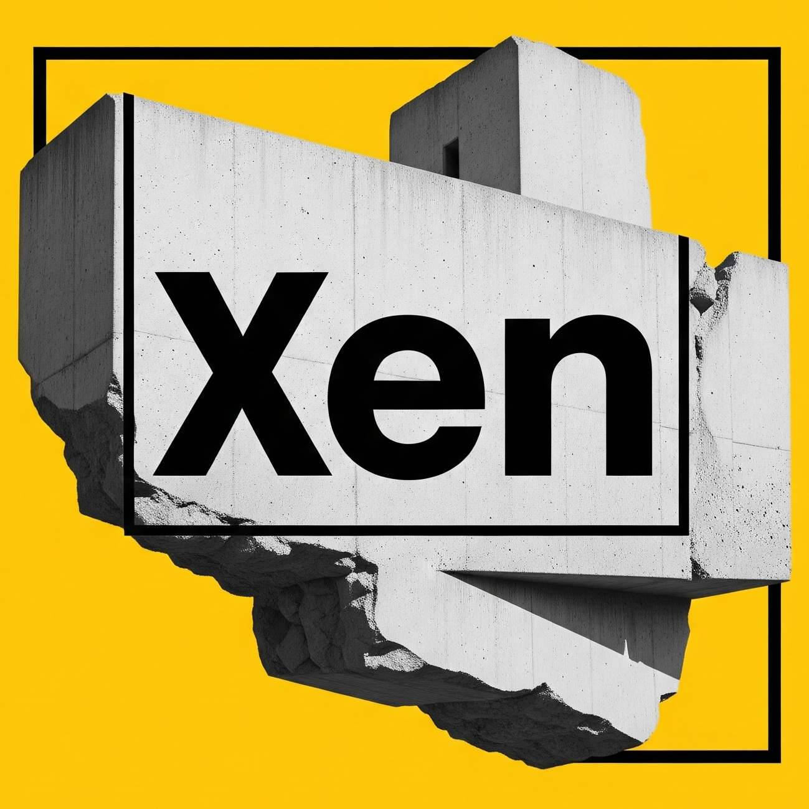

<p align="center">
  <a href="https://bineta.io">
    
  </a>
</p>

<h1 align="center">Xen – AI Replies for X (Twitter)</h1>

<p align="center">
  AI that writes tone-matched X/Twitter replies in one click — free, customizable, BYO key
</p>

<p align="center">
  <a href="https://chrome.google.com/webstore/detail/eijgkablmpomnoghhfelpfiilagdbjkb">
    
  </a>
  
</p>

## What is Xen?

Xen is a browser extension that helps you create on-brand, tone-matched replies in one click. Free & customizable. Bring your own OpenRouter key and start growing today.
It adds a special "Xen" button right next to the standard reply button on tweets.

## Why Xen?
• Open-source & transparent – inspect the code, fork, contribute
• 100% free – you only cover your own OpenRouter usage
• Tone-match & persona edit – sound exactly like you, from witty founder to thoughtful PM
• Built for startup teams – reply faster, engage more, build authority
• One-click AI replies right inside X
• Privacy-first: runs in your browser, no hidden servers


## Results You’ll Love
• Never stare at a blank reply box again
• Join conversations instantly and consistently
• Grow followers & amplify brand awareness without extra headcount

## How It Works
1. Install Xen
2. Paste your OpenRouter API key (2 mins)
3. Hit "Xen" on any reply → post
4. Adjust style or persona anytime

## Trust & Transparency
• No background posting, no data harvesting, no TOS risks

## For contributors
Contributions are welcome! Feel free to submit a pull request or open an issue.

Xen is a Plasmo extension. Here's how to install it in your browser:

To work on Xen:

1.  **Clone the project:**
    ```bash
    git clone https://github.com/bineta-io/xen.git
    cd xen
    ```
2.  **Install necessary files:**
    ```bash
    npm install
    ```
3.  **Start development server:**
    ```bash
    npm run dev
    ```
4.  **Load in your browser (Chrome/Brave/Edge):**
    1.  Go to `chrome://extensions` (or `brave://extensions`, `edge://extensions`).
    2.  Turn on "Developer mode" (usually in the top right).
    3.  Click "Load unpacked" and choose the `build/chrome-mv3-prod` folder.

## 📄 License

See the [LICENSE](LICENSE) file for details.
